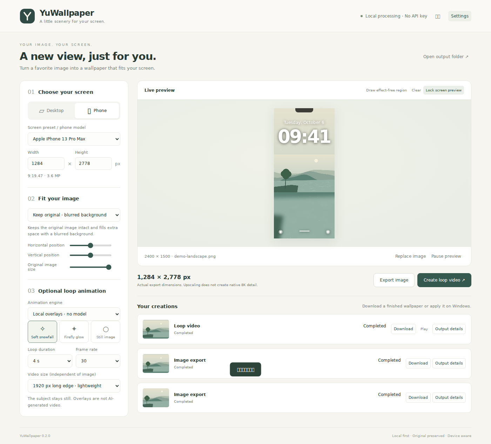

# YuWallpaper

[简体中文](README.zh-CN.md) · English

**Local-first, device-aware wallpapers.** Turn an image into a high-resolution desktop or phone wallpaper, add seamless particle loops, and apply it on Windows.



## Try it

Download the **Windows x64 portable ZIP** from Releases, extract it to a writable folder, then double-click **Start-YuWallpaper.vbs** (or the `.bat` launcher). Python, Pillow and FFmpeg are bundled. No account, API key or subscription is required for the basic features. Windows 10/11 with Microsoft Edge is the primary target; a browser is used if Edge is unavailable.

For source users:

```bash
python -m pip install -r requirements.txt
python main.py
```

Python 3.12 is the supported runtime. The local interface binds to `127.0.0.1` on a random port, with a per-launch session cookie. No external frontend assets are loaded. Closing the interface stops the local service after 60 idle seconds, unless a job is still active.

## v0.2: experimental local AI hair / blink

Install the **AI video runtime** in Settings, then **Check GPU**. This preset targets a 24GB-class NVIDIA CUDA GPU. Choose the local AI engine, paint hair regions, and separately paint eyes if requesting a blink. Blinking is off by default. Start with Draft and preview the output before standard/full-size exports.

Uses `WanImageToVideoPipeline` with Wan2.2 TI2V-5B. First generation downloads large model weights (potentially tens of GB); weights are not bundled. Inference uses approximately 768/1280-pixel long-edge frames. The source frame is restored outside the hand-painted mask before lossy video encoding. Forward/back motion and forward-to-original boundary envelopes are available; neither guarantees natural blinking or invisible compositing seams.

**Real model inference has not been run in this environment (no CUDA GPU). Hair and blink quality remain unverified.** Compositing, validation and model API contracts have tests; synthetic test frames are not evidence of generated output quality. The painted preview shows a selection, not a live AI animation.

## Features

- Desktop defaults to **7680 × 4320 (16:9)**; phone defaults to **2160 × 3840 (9:16)**.
- Verified device presets with source URLs; custom dimensions and ultrawide / portrait monitors.
- Preserve the full original on a blurred backdrop, or crop to fill with adjustable composition.
- Optional **local AI outpainting**: click to install the runtime; first generation downloads an inpainting model. Original foreground is restored after inference.
- PNG exports; independent MP4 size, 4 / 8 / 16-second loops, 24 / 30 / 60 fps.
- Snow and firefly overlays with a rectangular effect-free region. No whole-image warping or artificial blinking.
- Sequential job queue, progress, cancellation, downloadable provenance metadata.
- Chinese / English UI; native Windows static-wallpaper application; Lively integration for videos.

## What the version actually does

This is **v0.2**. The default overlay engine is deterministic particle compositing. The optional AI engine generates motion locally and restores unselected original pixels. Natural hair / blink output quality is not yet verified. The default layout uses a blurred backdrop, not AI. AI background extension is opt-in and runs entirely locally.

An 8K file means 7680 × 4320 output pixels. Resampling a smaller input does **not** create native 8K detail. The AI background is inferred at a maximum 768-pixel edge and enlarged for export; the original foreground is restored at the output resolution. Video defaults to a 3840-pixel long edge to control encoding costs; full-size video is available explicitly. Encoding uses CPU `libx264`, not GPU inference.

Phone exports are images and MP4 files. This version does **not** directly set phone wallpapers or generate compatible iPhone Live Photos. Phone clock previews are composition guides, not exact OS simulations.

## Optional AI

In Settings, choose **Install local AI runtime**. This installs pinned dependencies into a separate user-data directory. First AI export downloads `stable-diffusion-v1-5/stable-diffusion-inpainting` from Hugging Face. Expect several GB of downloads and additional disk space; an internet connection is needed for setup. CPU fallback is supported by the inference code but can be very slow. GPU availability depends on the installed PyTorch wheel and driver. No hardware performance claim has been benchmarked.

The background prompt is English by default. AI is not guaranteed to match every style, and seams may appear where the original meets the generated background. Original pixels are only resampled for placement and are never replaced by model output.

## Windows video wallpaper

Install [Lively Wallpaper](https://www.rocksdanister.com/lively/). Enter the path to `livelycu.exe` in Settings (or add it to PATH), generate a video, then choose **Apply on Windows**. Static image application does not need Lively. Lively is independently licensed and not bundled.

## Development and release

```bash
python -m unittest discover -s tests -v
python scripts/build_portable.py
```

The cross-platform packaging script downloads the official embeddable Windows Python distribution and SHA-256-verified PyPI wheels. `.github/workflows/release.yml` tests and builds the portable distribution; a `v*` tag publishes release assets. See [architecture](docs/architecture.md), [validation](docs/VALIDATION.md) and [third-party notices](THIRD_PARTY.md).

MIT covers YuWallpaper code. Optional model weights, bundled Python/Pillow/FFmpeg, and external Lively have their own licenses. User images and generated files are not committed to the repository.
