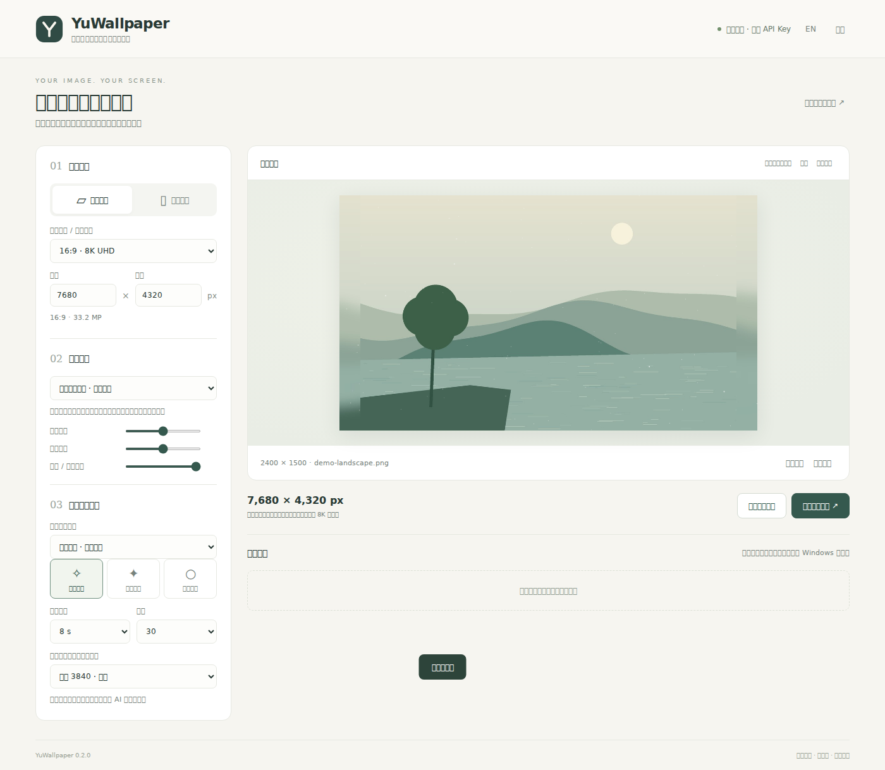

# YuWallpaper

简体中文 · [English](README.md)

**本地优先、按设备适配的高清壁纸工具。** 导入图片，选择电脑或手机，调整构图，导出高清图片和循环动态壁纸。



## 下载即用

从 Releases 下载 **Windows x64 便携 ZIP**，解压到可写目录，双击 **Start-YuWallpaper.vbs**；也可运行 `Start-YuWallpaper.bat`。基础功能不需要安装 Python、注册账号、填写 API Key 或付费。主要面向 Windows 10/11；使用 Edge 独立应用窗口，没有 Edge 时使用默认浏览器。

源码运行：

```bash
python -m pip install -r requirements.txt
python main.py
```

支持 Python 3.12。图片、任务结果和设置保存在本机用户目录。界面关闭后，本地服务在空闲 60 秒后退出；正在执行的任务继续完成。

## v0.2：本地 AI 头发 / 眨眼（实验）

1. 设置 → 安装 AI 视频运行环境。它与图片扩图依赖分开安装，使用 CUDA 12.8 的 PyTorch。
2. 点击“检查显卡”。此预设面向 24GB 级 NVIDIA 显卡（如 4090）；无 CUDA 时会在下载模型前报错。
3. 导入图片并调整构图；动态生成方式选“本地 AI”。点击“涂选头发”，在预览上涂需要运动的区域。
4. 如需眨眼，点击“涂选眼睛”分别涂两只眼，再勾选眨眼。眨眼默认关闭。
5. 首次选“试生成”。完成后播放结果，检查头发接缝和眼皮。满意后再选标准质量或高清输出。

首次生成会下载 Wan2.2 TI2V-5B 模型，可能需要数十 GB 存储和较长下载时间。模型不在基础包内。提供平滑往返循环（适合头发）与顺序播放、首尾回到原图（适合试眨眼）；这些处理无法保证每张图片都自然。未涂区域在视频编码前保留原图；MP4 有损编码仍可能改变少量像素值。

**本版已接入真实模型调用，但尚未在 CUDA 设备上实测模型输出，头发和眨眼质量待验证。** 运动区域来自约 768 / 1280 长边的模型输出，再放大，不是原生 8K 动态；手工选区不能阻止模型在选区内部改变五官。预览中的色块只显示选区，运动在生成后才能播放。

## 能做什么

- 电脑默认 **16:9 / 7680×4320（8K 输出尺寸）**；手机默认 **9:16 / 2160×3840**。
- 手机型号按真实屏幕分辨率适配，预设附有官方来源；支持自定义尺寸、超宽屏和竖屏显示器。
- 保留完整原图并柔化背景，或铺满屏幕裁剪；可调整水平、垂直位置和原图大小。
- 可选本地 AI 扩图：设置中主动安装依赖，首次生成下载模型；只补绘背景，完成后重新覆盖原图。
- 高清 PNG；视频分辨率独立设置，4 / 8 / 16 秒循环、24 / 30 / 60 FPS。
- 循环飘雪、萤火光点；框选人物避让区，不让特效挡住脸。
- 排队、进度、取消；附带输出尺寸和处理方式的 JSON 信息。
- 中英文界面；Windows 静态壁纸直接应用，动态壁纸通过 Lively 应用。

## 诚实说明效果边界

**特效模式**是本地粒子合成；**AI 模式**调用 Wan2.2 生成，再将涂选区域合成回原图。两者在界面上独立选择。默认柔化背景不属于 AI 扩图；本地 AI 功能需单独启用。

8K 指输出像素尺寸，小图放大不等于原生 8K 细节。本地 AI 背景最大在约 768 像素长边推理，再放大到目标尺寸；原图部分在最终输出时恢复，生成模型不会重画原图人物。扩展背景可能存在风格差异或接缝。

视频默认长边 3840，可选择匹配图片尺寸。视频编码使用 CPU 的 `libx264`；8K、60 FPS 可能很慢，编码速度与机器有关。手机端本版只导出图片和 MP4，不直接设置手机壁纸，也不生成 iPhone Live Photo。锁屏叠层只作构图参考。

## 本地 AI 的首次下载

设置 → **安装本地 AI 运行环境**。依赖和首次下载的模型需要数 GB 空间及联网。模型为 `stable-diffusion-v1-5/stable-diffusion-inpainting`，来源为 Hugging Face，不需要 API Key。下载受网络条件影响，失败会显示错误，可重试。

优先使用可用 CUDA GPU；CPU 推理可能很慢。GPU 是否可用取决于 PyTorch 和驱动，尚未进行本机性能实测。不在基础安装包中捆绑模型。

## 应用动态桌面

先安装 [Lively Wallpaper](https://www.rocksdanister.com/lively/)，在设置中填写 `livelycu.exe` 的完整路径，或将其加入 PATH。生成完成后点“应用桌面”。静态壁纸应用无需 Lively。Lively 独立授权，不随本软件捆绑。

## 开发与发布

```bash
python -m unittest discover -s tests -v
python scripts/build_portable.py
```

提供 GitHub Actions：测试、构建 Windows 便携包，推送 `v*` 标签后发布 Release。详见 [架构说明](docs/architecture.md)、[验证记录](docs/VALIDATION.md) 和 [第三方许可](THIRD_PARTY.md)。

YuWallpaper 源码使用 MIT 许可。Python、Pillow、FFmpeg、本地模型及 Lively 遵循各自许可；个人图片、生成作品和密钥不进入仓库。
