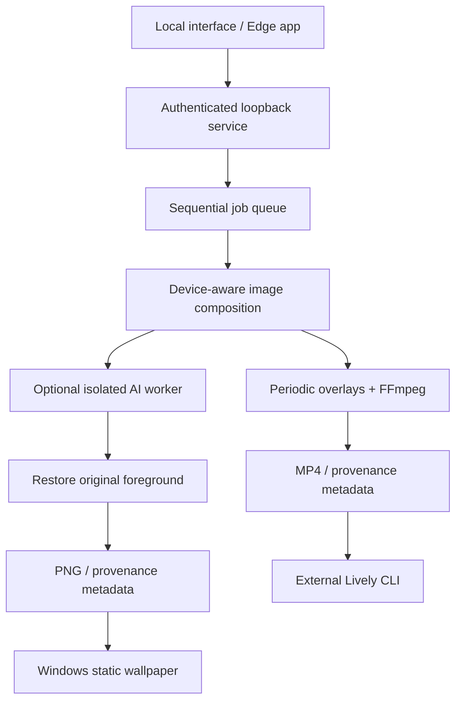

# Architecture

## Boundaries

- Browser view has no Node integration and does not receive arbitrary filesystem access.
- HTTP binds only to loopback. A random launch token creates an HttpOnly SameSite=Strict session cookie. Host / Origin checks prevent remote sites from changing settings or launching jobs. No wildcard CORS, remote frontend assets or credential storage.
- File access uses opaque upload/job identifiers and a finished-artifact allowlist. User filenames never become filesystem paths. Uploads are limited to 50 MiB and Pillow checks decompression-bomb limits. All images are normalized to RGB and EXIF orientation is applied.
- Single-worker queue bounds concurrent image allocations and encoding. Cancellation terminates active FFmpeg / AI subprocesses. Outputs are published only after successful completion. Failed/cancelled output directories are removed.
- AI runs separately with user-data package and model paths. Installation is explicit and the base app works without optional dependencies. Downloads are not inference API calls.
- Applying a video invokes Lively using an argument array, never a shell command. Static wallpaper uses the Windows system API.

## Quality provenance

`metadata.json` records input/output dimensions, layout, cloud inference false, AI working resolution if used, and animation method. Generated background pixels are enlarged; the original foreground is composited afterward. No claim of native 8K generative detail or benchmarked GPU acceleration.

## Current limits

Rectangular rather than semantic motion protection; particle overlays and manually selected experimental AI motion; local Wan2.2 I2V backend (CUDA inference unverified); CPU video encoding; manual Lively CLI selection when autodetection fails; limited verified device catalog plus custom resolution; phone files only. A future video backend should pass subject-consistency and temporal-boundary validation before becoming a default mode.

## AI video pipeline (v0.2)

Painted hair/eye masks → CUDA preflight → isolated Wan I2V worker → generated PNG frames → inward-feathered selection → restore original outside mask → periodic timing → FFmpeg. The video environment is separate from image outpainting. Unselected regions do not depend on generated pixels.
